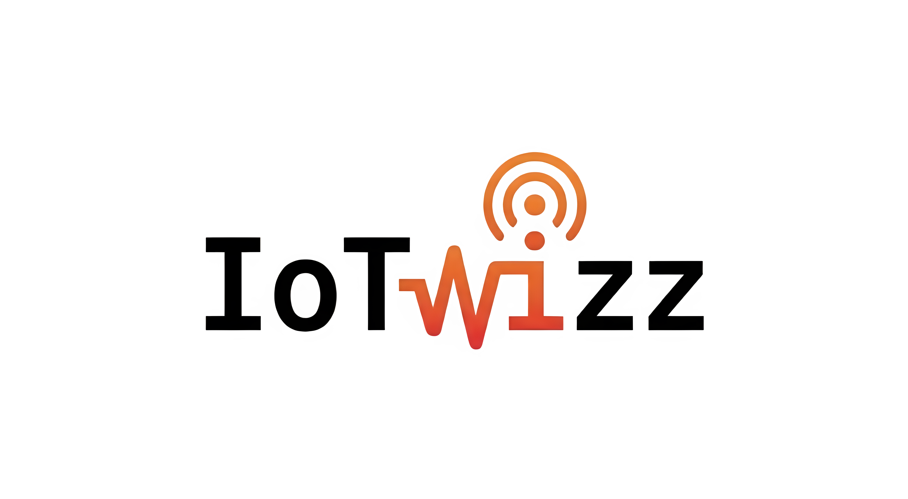

<div align="center">

  <picture>
    <source media="(prefers-color-scheme: dark)" srcset="Dark%20logo.png" />
    <source media="(prefers-color-scheme: light)" srcset="logo.png" />
    
  </picture>

  <br/>

  

  <br/><br/>

  <p>
    
    
    
    
    
  </p>

  <p>
    
    
    
  </p>

  <br/>

  <p>
    <strong>A modular IoT security testing framework inspired by Metasploit.</strong><br>
    Built for hardware hackers, firmware analysts, and IoT security researchers.
  </p>

  <p>
    <a href="#quick-start"></a>
    <a href="#features"></a>
    <a href="#modules"></a>
    <a href="#contributing"></a>
  </p>

</div>

---


## Overview

IoTwizz is a comprehensive, open-source penetration testing framework specifically engineered for the Internet of Things (IoT) landscape. 🔧 Inspired by the modular and extensible architecture of Metasploit, IoTwizz serves as a Swiss Army Knife for security researchers, hardware hackers, and penetration testers who need a unified toolkit to audit embedded devices, analyze firmware, and test hardware-level protocols.

As the IoT ecosystem expands, the attack surface grows exponentially, from exposed UART and JTAG debug interfaces on circuit boards to hardcoded credentials and vulnerable bootloaders. IoTwizz bridges the gap between hardware and software exploitation by providing an interactive, centralized console (powered by `prompt-toolkit` and `rich`) to manage complex security assessments.

> Meet AiWizz, an interactive AI hacking assistant powered by Large Language Models (Gemini, OpenAI, Claude, Ollama) that can autonomously select, configure, and execute modules on your behalf. 🤖

---

## Features

<div align="center">

| Category | Module | Status | Description |
|:--------:|:-------|:------:|:------------|
| **UART** | `uart/baud_rate_finder` | Ready | Auto-detect UART baud rates |
| **Exploit** | `exploit/uboot_breaker` | Ready | Intercept U-Boot and gain shell |
| **Recon** | `recon/default_creds` | Ready | Test IoT default credentials |
| **Firmware** | `firmware/binwalk_analyzer` | Ready | Firmware analysis and extraction |
| **AI** | `ai/aiwizz` | Ready | Interactive AI hacking assistant |
| **Hardware** | `hardware/jtag_swd_scanner` | Ready | JTAG/SWD debug interface scanner |
| **Hardware** | `hardware/spi_flash_dumper` | Ready | SPI flash firmware dumper |
| **Protocol** | `protocol/mqtt_fuzzer` | Ready | MQTT protocol fuzzer |
| **Protocol** | `protocol/coap_fuzzer` | Ready | CoAP protocol fuzzer |
| **Wireless** | `wireless/ble_scanner` | Ready | Bluetooth Low Energy scanner |
| **Wireless** | `wireless/zigbee_sniffer` | Ready | Zigbee/Z-Wave sniffer |

</div>

---

## Quick Start

### Installation ⚡

```bash
# Clone the repository
git clone https://github.com/iotwizz/iotwizz.git
cd iotwizz

# Install dependencies
pip install -r requirements.txt

# Install IoTwizz
pip install -e .

# Launch
iotwizz
```

### Standalone Binary (No Python Required)

For macOS users, a fully self-contained binary is provided:

```bash
./dist/iotwizz
```

### Basic Usage

```bash
iotwizz > show modules                      # List all modules
iotwizz > use uart/baud_rate_finder         # Select a module
iotwizz(uart/baud_rate_finder) > info       # View module info
iotwizz(uart/baud_rate_finder) > set PORT /dev/ttyUSB0
iotwizz(uart/baud_rate_finder) > run        # Execute
```

---

## Modules

### UART Baud Rate Finder
Automatically detects the baud rate of UART serial connections.

```bash
iotwizz > use uart/baud_rate_finder
iotwizz(uart/baud_rate_finder) > set PORT /dev/ttyUSB0
iotwizz(uart/baud_rate_finder) > run
```

### U-Boot Breaker
Intercept U-Boot boot sequence to gain bootloader shell access.

```bash
iotwizz > use exploit/uboot_breaker
iotwizz(exploit/uboot_breaker) > set PORT /dev/ttyUSB0
iotwizz(exploit/uboot_breaker) > set BAUD_RATE 115200
iotwizz(exploit/uboot_breaker) > run
# Power cycle the device when prompted
```

### Default Credential Checker
Tests IoT devices for default/known credentials over SSH, Telnet, HTTP, or FTP.

```bash
iotwizz > use recon/default_creds
iotwizz(recon/default_creds) > set TARGET 192.168.1.1
iotwizz(recon/default_creds) > set SERVICE ssh
iotwizz(recon/default_creds) > run
```

### Firmware Analyzer
Analyzes firmware images using binwalk for signature scan, entropy, and extraction.

```bash
iotwizz > use firmware/binwalk_analyzer
iotwizz(firmware/binwalk_analyzer) > set FIRMWARE_FILE ./firmware.bin
iotwizz(firmware/binwalk_analyzer) > set EXTRACT true
iotwizz(firmware/binwalk_analyzer) > run
```

### AiWizz (AI Hacking Assistant)
Talk to an AI expert that controls IoTwizz and analyzes results for you.

```bash
iotwizz > use ai/aiwizz
iotwizz(ai/aiwizz) > set PROVIDER gemini
iotwizz(ai/aiwizz) > set API_KEY your_key_here
iotwizz(ai/aiwizz) > run
AiWizz > "Scan 192.168.1.1 for default SSH credentials"
```

---

## Creating Custom Modules

IoTwizz has a powerful plugin architecture. Add new modules in 5 steps:

```python
from iotwizz.base_module import BaseModule
from iotwizz.utils.colors import success, error, info

class MyCustomModule(BaseModule):
    def __init__(self):
        super().__init__()
        self.name = "My Custom Tool"
        self.description = "Does something awesome"
        self.author = "Your Name"
        self.category = "recon"
        self.options = {
            "TARGET": {
                "value": "",
                "required": True,
                "description": "Target to scan",
            },
        }

    def run(self):
        target = self.get_option("TARGET")
        info(f"Scanning {target}...")
        # Your exploit logic here
        success("Done!")
```

1. Create `.py` in `iotwizz/modules/<category>/`
2. Inherit from `BaseModule`
3. Define `name`, `description`, `author`, `category`, `options`
4. Implement `run()` method
5. Auto-discovery handles the rest

---

## Requirements

### Core Dependencies
```
python >= 3.8
pyserial        # Serial/UART communication
rich             # Beautiful terminal output
prompt-toolkit   # Interactive console
paramiko         # SSH connections
requests         # HTTP requests
scapy            # Network packet crafting
paho-mqtt        # MQTT protocol
```

### AI Providers (Optional)
```
google-generativeai   # Gemini
openai                # GPT models
anthropic             # Claude
ollama                # Local LLMs
```

### Optional
```
binwalk          # Firmware analysis (system package)
```

---

## Security Disclaimer ⚠️

> **IMPORTANT**: IoTwizz is intended for **authorized security testing only**.

- Only use on devices and networks you **own** or have **explicit written permission** to test
- Unauthorized access to computer systems is **illegal**
- The authors assume **no liability** for misuse or damage

---

## Contributing

We welcome contributions from the security community.

```bash
# 1. Fork the repository
# 2. Create your feature branch
git checkout -b feature/amazing-module

# 3. Add your module to iotwizz/modules/<category>/
# 4. Test thoroughly
# 5. Submit a Pull Request
```

**Contributing Guidelines:**
- Follow the existing code style
- Add documentation for new modules
- Include error handling
- Test on real hardware when possible

---

## License

This project is licensed under the **Creative Commons Attribution-NonCommercial 4.0 International License**.

[](http://creativecommons.org/licenses/by-nc/4.0/)

**You are free to:**
- Share: copy and redistribute the material
- Adapt: remix, transform, and build upon the material

**Under the following terms:**
- Attribution: You must give appropriate credit
- NonCommercial: You may not use the material for commercial purposes

---

## Acknowledgments

- Inspired by [Metasploit Framework](https://www.metasploit.com/)
- Built with [Rich](https://github.com/Textualize/rich) and [prompt-toolkit](https://github.com/prompt-toolkit/python-prompt-toolkit)
- Thanks to the IoT security research community

---

<div align="center">

  

  <br/>

  <strong>Built by <a href="https://github.com/khushalmistry">Khushal Mistry</a></strong>

  <p>
    <a href="https://github.com/khushalmistry"></a>
  </p>

  <br/>

  <em>Happy Hacking 💀</em>

  <br/><br/>

  

</div>

---

## Building Standalone Binaries

IoTwizz can be compiled into standalone binaries that don't require Python installation.

### Quick Build (Current Platform)

```bash
# Install build dependencies
pip install pyinstaller

# Build
./scripts/build-binaries.sh

# Or using make
make build
```

### Output Binaries

Binaries are placed in the `dist/` directory:

| Platform | Binary Name |
|----------|-------------|
| macOS ARM64 | `iotwizz-macos-arm64` |
| macOS Intel | `iotwizz-macos-x64` |
| Linux x64 | `iotwizz-linux-x64` |
| Linux ARM64 | `iotwizz-linux-arm64` |
| Windows x64 | `iotwizz-windows-x64.exe` |
| Windows ARM64 | `iotwizz-windows-arm64.exe` |

### Cross-Platform Builds

For cross-platform builds, use GitHub Actions or Docker:

```bash
# Using Docker for Linux builds
docker build -t iotwizz-builder -f Dockerfile.linux-x64 .
docker create --name iotwizz-temp iotwizz-builder
docker cp iotwizz-temp:/output/iotwizz-linux-x64 dist/
docker rm iotwizz-temp
```

### GitHub Actions (Recommended)

Push a version tag to trigger automated builds:

```bash
git tag v1.1.0
git push origin v1.1.0
```

This creates binaries for all 6 platform/architecture combinations.

## AiWizz AI Assistant

The integrated AI assistant can execute modules on your behalf:

```
iotwizz > use ai/aiwizz
iotwizz(ai/aiwizz) > set PROVIDER gemini
iotwizz(ai/aiwizz) > set API_KEY your_api_key
iotwizz(ai/aiwizz) > run

AiWizz > Scan 192.168.1.1 for default credentials
AiWizz > Analyze this firmware file
AiWizz > Help me find the UART baud rate
```

Supported AI providers:
- **Gemini** (default, free tier available)
- **OpenAI** (GPT-4)
- **Claude** (Anthropic)
- **Ollama** (local LLMs)
- **DeepSeek**
- **MiniMax**

## Changelog

### v1.1.0
- **AiWizz AI Assistant**: Complete redesign with framework integration
- **UART Baud Rate Finder**: Auto-detection, pattern analysis, cross-platform
- **Default Credential Checker**: Threading, multiple services, expanded database
- **Firmware Analyzer**: Built-in signatures, entropy analysis, secret search
- **JTAG/SWD Scanner**: Multi-adapter support, device identification
- **SPI Flash Dumper**: Comprehensive programmer support, verification
- **MQTT Fuzzer**: Multiple modes, ACL testing
- **CoAP Fuzzer**: Resource discovery, stress testing
- **BLE Scanner**: Service enumeration, continuous mode
- **Zigbee Sniffer**: Channel scanning, PCAP export
- **Build System**: Cross-platform binaries for 6 architectures
- **Configuration**: User config directory, workspace support

